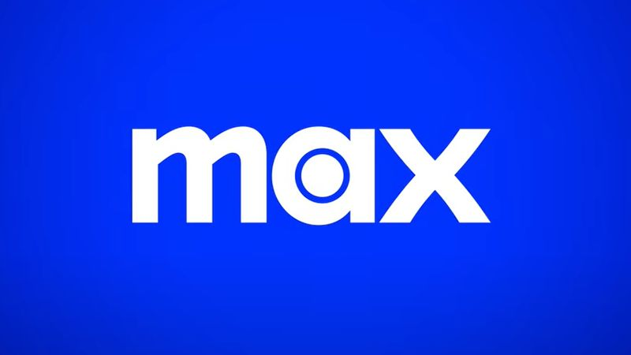

<div align="center">


# Streaming enhanced 


## Automatically skip Ads, Intros, Recaps, Credits, etc. on Netflix, Prime video, Disney+ (Hotstar, STAR+), Crunchyroll and HBO max

<a href="https://addons.mozilla.org/firefox/addon/netflix-prime-auto-skip/">


</a>
<br>
<a href="https://chrome.google.com/webstore/detail/streaming-enhanced-netfli/akaimhgappllmlkadblbdknhbfghdgle">


</a>
<br>


<br>
<a href="(https://github.com/sponsors/Dreamlinerm">

</a>
<a href="https://www.paypal.com/donate/?hosted_button_id=N7CEVV9CCJWM6">

</a>
<a href="https://github.com/sponsors/Dreamlinerm">

</a>
<br>
<a href="https://discord.gg/5fBYathA7d">

</a>
</div>


<p align="center">
<a href="https://addons.mozilla.org/firefox/addon/netflix-prime-auto-skip/">
<a href="https://chrome.google.com/webstore/detail/streaming-enhanced-netfli/akaimhgappllmlkadblbdknhbfghdgle">
<a href="https://microsoftedge.microsoft.com/addons/detail/streaming-enhanced-netfli/dhfpagghjamocfaaignghcljfpppelff">
</p>

***

### Language

I used DeepL to translate into most languages. If there is anything wrong with them you can see [here](https://github.com/Dreamlinerm/Netflix-Prime-Auto-Skip/issues/42) what to do.

### Browser Compatibility:

| Netflix | Prime Video     | Disney+ (Hotstar, STAR+) | Crunchyroll | HBO    |
| ---     | ---             | ---                      | ---         | ---    |
| ✅      | ✅             | ✅                      | ✅          | ✅     |

## Install on Android

<div style="display:flex">
                <a href="https://addons.mozilla.org/firefox/addon/netflix-prime-auto-skip/">
                
                </a>
                <a href="https://play.google.com/store/apps/details?id=com.kiwibrowser.browser">
                
                </a>
</div>

Download [Firefox](https://addons.mozilla.org/firefox/addon/netflix-prime-auto-skip/), [Kiwi Browser](https://play.google.com/store/apps/details?id=com.kiwibrowser.browser) or similar to be able to install the firefox/chrome extension. 

The drm for each streaming service will be installed automatically when a video started for the first time and you may need to reload the page once.

## Android Compatibility:

| Netflix | Prime Video         | Disney+ (Hotstar, STAR+) | Crunchyroll | HBO                |
| ---     | ---                 | ---                      | ---         | ---                |
| ❌     | ✅(tweaked Desktop Website) | ✅(default Desktop Website)      | ✅         | ✅ |

## Supported Streaming Services

<table>
    <tr>
      <td align="center" valign="top" width="14.28%">
        
        
        
        
        
        
        
      </td>
    </tr>
</table>

## What it does

The script, "skipper.js", is injected into all urls containing "amazon.\*/\*/video" or "netflix.com" or "disneyplus.com" or "hotstar.com" or "starplus.com".

It automatically skips Ads, intros, Credits, recaps, and anything else you don't want to watch on Netflix, Prime video and Disney Plus (Hotstar, STAR+).

## ✨ Features

Features in other supported languages:
| [Deutsch](docs/storeDescriptions/de.md) |
| [Français](docs/storeDescriptions/fr.md) |
| [Español](docs/storeDescriptions/es.md) |
| [Português](docs/storeDescriptions/pt.md) |
| [Português (Brasil)](docs/storeDescriptions/pt_br.md) |
| [Italiano](docs/storeDescriptions/it.md) |
| [日本語](docs/storeDescriptions/ja.md) |
| [Polski](docs/storeDescriptions/pl.md) |
| [Svenska](docs/storeDescriptions/sv.md) |
| [汉语](docs/storeDescriptions/zh_CN.md) |
| [한국어](docs/storeDescriptions/ko.md) |
| [Türkçe](docs/storeDescriptions/tr.md) |

This extension enhances your streaming experience on Netflix, Prime Video, Disney+ (Hotstar, STAR+), Crunchyroll, and HBO Max by automatically:

<ul>
  <li>Block Ads</li>
  <li>Skipping Intros & Recaps</li>
  <li>Skipping Credits</li>
  <li>Displaying TMDB ratings for all shows</li>
  <li>Adding customizable playback speed control</li>
  <li>Automatically start to play videos in fullscreen</li>
  <li>Go fullscreen on double click</li>
</ul>

Platform-Specific Features:

<ul>
<li>Netflix:
  <ul>
    <li>Remembers and selects your last-used profile automatically</li>
    <li>Blocks the “Are you still watching?” inactivity warning</li>
  </ul>
</li>
<li>Amazon Prime Video:
  <ul>
    <li>Skips self-promotional ads (for Prime Video productions)</li>
    <li>Filters out paid content (movies, series) from the home page</li>
    <li>Removes the blur effect when hovering over videos</li>
  </ul>
</li>
<li>Disney+ (Hotstar, STAR+):
  <ul>
    <li>Skips self-promotional ads</li>
    <li>Automatically returns to fullscreen mode when going to the next episode</li>
  </ul>
</li>
<li>Crunchyroll:
  <ul>
    <li>Remembers and selects your last-used profile automatically</li>
    <li>Adds filters to the release calendar, so it is useable</li>
    <li>Video size expanded to entire window</li>
    <li>Disable the numpad</li>
  </ul>
</li>
</ul>

If you want to see what is implemented go [here](#implemented-feature-overview):

## 💕 Enjoying Streaming enhanced?

Buy me a [coffee](https://github.com/sponsors/Dreamlinerm)! 

## Contributing

If you have any suggestions or Bugs, please open an issue or join the  [Discord](https://discord.gg/7us76ErE). 
Everyone is welcome to contribute!

## Settings

You can customize which features are enabled in the Settings.

Import and Export all Settings.

See Statistics. All statistics and settings are not shared but are synchronized with your browser account.

## Ratings

The ratings are gathered from the TMDB API. Ratings are refreshed every month.
If there is no score they are refreshed once per day. If the movie is newer than 50 days and has less than 100 votes it will get refreshed every 3 days.

| Rating | Explanation |
| --- | --- |
| ? | Title not found |
| N/A | Too new movie or less than 80 votes |
| <div style="background-color:grey;width:20px;height:20px;"><div> | ? or N/A |
| <div style="background-color:red;width:20px;height:20px;"><div> | <= 5.5 stars|
| <div style="background-color:rgb(245, 197, 24);width:20px;height:20px;"><div> | <= 7 stars|
| <div style="background-color:rgb(0, 166, 0);width:20px;height:20px;"><div> | >7 stars|


# Implemented Feature Overview

| abbrev. | definition |
| --- | --- |
|S|season|
|E|episode|
|✅| Implemented|
|➖| Not available|
|❌| Not implemented|
|?| don't know if necessary|
| Name| service specific features|

| Feature | Netflix | Prime Video | Disney+ (Hotstar, STAR+) | Crunchyroll | HBO max |
| --- | --- | --- | --- | --- | --- |
| Intro | ✅ <a href="https://www.netflix.com/watch/80011385">brooklyn nine nine S1E4</a>| ✅  <a href="https://www.amazon.de/gp/video/detail/B07FMF18GN">lucifer S3E4</a>| ✅ <a href="https://www.disneyplus.com/en-gb/video/4e9305a0-6ade-4922-bfba-c68c53a0d5a6">star wars andor S1E2</a> | ✅ [One piece](https://www.crunchyroll.com/series/GRMG8ZQZR/one-piece) | ✅ |
| Recaps | ✅ <a href="https://www.netflix.com/watch/81274622">Outer Banks S2E1</a>| ✅ <a href="https://www.amazon.de/gp/video/detail/B07FMF18GN">lucifer S3E3</a> | ✅ <a href="https://www.disneyplus.com/en-gb/video/efe020f1-7a23-42b5-a330-b193eef8531b">Criminal Minds S1E2</a>| ? | ✅ |
| Credits | ✅ | ✅ | ✅ | ❌(not necessary if outro is skipped) | ✅ |
| Ads | ✅ | ✅ [2 Broke Girls](https://www.amazon.de/gp/video/detail/B01D0H8CAY/ref=atv_hm_fre_c_zwoINQ_2_2?jic=36%7CCgtmcmVld2l0aGFkcxIMc3Vic2NyaXB0aW9u) | ✅ | ❌(Ublock can do it) | ? |
| Add Speed Slider | ✅ | ✅ | ✅ | ✅ | ✅ |
| Play on Fullscreen | ✅ | ✅ | ✅ | ✅ | ✅ |
| fullscreen on double click | ➖ | ✅ | ➖ | ✅ | ? |
| TMDB Rating | ✅ | ✅ | ✅ | ❌(MAL ratings better) | ✅ |
| Individual Features | <ul><li>Inactivity Warning</li><li>Auto pick last profile</li></ul> | <ul><li>Skip Self Ads</li><li>Paid Content filter</li><li>Move category "Continue":</li></ul> | <ul><li>Skip self ads</li><li>Remain fullscreen</li></ul> | <ul><li>Auto pick last profile</li><li>Release Calendar Filters</li><li>Big Video size</li><li>Disable the numpad</li></ul> | ➖ |

## How it works

The addon is observing every mutation of the dom Tree of the Website.

The exact classes may be outdated since I do not update these regularly.

On Netflix it matches the buttons with the data-uia tag containing:

* Intro: player-skip-intro
* Recap: player-skip-recap, player-skip-preplay
* Credits: next-episode-seamless-button
* Inactivity Warning: interrupt-autoplay-continue
* Basic tier ads: matched by css class .default-ltr-cache-mmvz9h and the speed is set to 16x until the ad is over

On Prime video it matches buttons with the Css Classes:

* Intro: skipelement
* Credits: nextupcard-button
* Self promoting ads: .fu4rd6c.f1cw2swo
* Paid Content: .o86fri (yallow text indicates paid films)
  
The freevee ad text contains the ad length which is matched by 

* Freevee ads: .atvwebplayersdk-ad-timer-text

and then skipped by forwarding by the ad length -0.1 seconds which will fix a lot of issues it turns out.

## Run the Extension

## Chrome

To run the extension in chrome you can just load the ``chrome`` folder as an unpacked extension. But every time you modify the code you have to reload the extension on the extension page manually.
I primarily just develop in firefox and then copy the code into chrome and replace ``browser`` with ``chrome`` in the code.

## Firefox 

Just like chrome you can temporarily load the extension by going to ``about:addons``, clicking on the gear icon and then ``Install Add-ons From File``. Then you can load the ``firefox`` folder as a temporary extension.

### Install web-ext and Firefox for a better development experience

```npm install --global web-ext``` to install web-ext globally

```npm start``` to start in firefox

### debug

Create a profile named ``test`` in Firefox in the ``about:profiles`` page. Then you can login into Netflix etc. in the profile and then every time you run the command you don't have to login again.

```npm run profile``` to start in firefox with the profile "test" selected

## All Commands

```npm start```  start the firefox development

```npm run start-android```  start on firefox android

```npm run profile```  start the firefox development with the profile "test" selected

```npm run lint```   lint all the js files

```npm run esLint``` lint all the manifest files

```npm run build```  copy files from firefox to chrome and build the zips files to upload

```npm run copy```   copy files from firefox to chrome

```npm run zip```    build the zips files to upload

```npm test```       test with python Selenium __testsOutdated__

## Test the Extension with Selenium python

### Setup

- insert your own firefox profile filepath to be logged into every platform in the ``test.py`` file.
- install Python
- install selenium ``pip install -U selenium``

### Run

```npm test```

Cli ARGS:
- none : all tests
- 'n': Netflix tests
- 'p': Prime Video tests
- 'd': Disney tests

```npm test n p d```

## Changelog

You can see the Changelog in the addon or in the published versions.

## Disclaimer

Netflix, Amazon Prime video and Disney+ (Hotstar, STAR+), Crunchyroll and HBO max are trademarks and the author of this addon is not affiliated with these companies.
