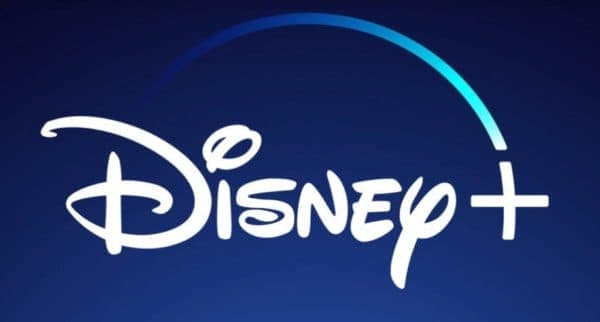

# Streaming enhanced 

## Automatically skip Ads, Intros, Recaps, Credits, etc.

 

 

 

---

## Download & Install

<a href="https://addons.mozilla.org/firefox/addon/netflix-prime-auto-skip/">
<a href="https://chrome.google.com/webstore/detail/streaming-enhanced-netfli/akaimhgappllmlkadblbdknhbfghdgle">
<a href="https://microsoftedge.microsoft.com/addons/detail/streaming-enhanced-netfli/dhfpagghjamocfaaignghcljfpppelff">

## Install on Android

                
                

Download [Firefox](https://addons.mozilla.org/firefox/addon/netflix-prime-auto-skip/), [Kiwi Browser](https://play.google.com/store/apps/details?id=com.kiwibrowser.browser) or similar to be able to install the firefox/chrome extension.

The DRM for each streaming service will be installed automatically when a video started for the first time and you may need to reload the page once.

### Supported Streaming Services

<table>
    <tr>
      <td align="center" valign="top" width="14.28%">
        
        
        
        
        
        
        
      </td>
    </tr>
</table>

  
The above table in markdown

  
  | Netflix | Prime Video | Disney+ (Hotstar, STAR+) | Crunchyroll | HBO |
  | ------- | ----------- | ------------------------ | ----------- | --- |
  | ✅       | ✅           | ✅                        | ✅           | ✅   |

## Table of Contents

- [Android Compatibility](#android-compatibility)
- [Contributing to Translation](#contributing-to-translation)
- [Features](#-features)
- [Ratings explanation](#ratings)
- [Implemented Feature Overview](#implemented-feature-overview)
- [Develop the Extension](#develop-the-extension)
- [Changelog](./CHANGELOG.md)

## Android Compatibility

| Netflix | Prime Video                 | Disney+ (Hotstar, STAR+)    | Crunchyroll | HBO |
| ------- | --------------------------- | --------------------------- | ----------- | --- |
| ❌      | ✅(tweaked Desktop Website) | ✅(default Desktop Website) | ✅          | ✅  |

## Contributing to Translation

We welcome contributions to the translation of the extension. If you're interested in helping us translate the extension to your language look [here](https://github.com/Dreamlinerm/Netflix-Prime-Auto-Skip/wiki/Add-or-Fix-Language-Localization).

## ✨ Features

Features in other supported languages:
| [Deutsch](docs/storeDescriptions/de.md) |
| [Français](docs/storeDescriptions/fr.md) |
| [Español](docs/storeDescriptions/es.md) |
| [Português](docs/storeDescriptions/pt.md) |
| [Português (Brasil)](docs/storeDescriptions/pt_br.md) |
| [Italiano](docs/storeDescriptions/it.md) |
| [日本語](docs/storeDescriptions/ja.md) |
| [Polski](docs/storeDescriptions/pl.md) |
| [Svenska](docs/storeDescriptions/sv.md) |
| [汉语](docs/storeDescriptions/zh_CN.md) |
| [한국어](docs/storeDescriptions/ko.md) |
| [Türkçe](docs/storeDescriptions/tr.md) |

<!-- description -->

Supported Streaming Services:

- Netflix
- Prime Video
- Disney+ (Hotstar, STAR+)
- Crunchyroll
- HBO Max
- Paramount+

✨ Features

You can customize which features are enabled in the Settings.

This extension enhances your streaming experience by automatically:

- Block Ads
- Skipping Intros & Recaps
- Skipping Credits
- Displaying TMDB ratings for all shows
- Hide Movie button
- Adding customizable playback speed control (keyboard shortcuts: s, d)
- Automatically start to play videos in fullscreen
- Go fullscreen on double click
- Scroll to change the volume

Platform-Specific Features:

- Netflix:
    - Remembers and selects your last-used profile automatically
    - Blocks the “Are you still watching?” inactivity warning
    - Remove games from Netflix

- Amazon Prime Video:
    - Skips self-promotional ads (for Prime Video productions)
    - Filters out paid content (movies, series) from the home page
    - Moves the category "Continue" to the top of the page
    - Hide the Xray Quick View over a video
    - Removes the blur effect when hovering over videos

- Disney+ (Hotstar, STAR+):
    - Skips self-promotional ads
    - firefox: add feature disney arrow keys fast forward

- Crunchyroll:
    - Remembers and selects your last-used profile automatically
    - Adds filters to the release calendar, so it is useable
    - Video size expanded to entire window
    - Disable the numpad controls

Android Support in Desktop mode:

- Prime Video
- Disney+ (Hotstar, STAR+)
- Crunchyroll
- HBO Max
  To use the extension on an Android phone, download Firefox.

Broken Features:

- At any time the websites can update their UI, which may break various features of the extension.
- If you encounter any issues, please report them on the [Github issue tracker](https://github.com/Dreamlinerm/Netflix-Prime-Auto-Skip/issues).
- You can also write a review to report issues. Please avoid giving a bad rating, as I will always respond regardless of the rating, since I receive an E-mail.
- Since I am a single developer, I may not be able to fix issues immediately. Please be patient and I will do my best to resolve them as soon as possible.

## ☔ Safe & Open Source
This extension is open-source! Feel free to contribute or explore the code on [Github](https://github.com/Dreamlinerm/Netflix-Prime-Auto-Skip).

## 💕 Enjoying Streaming enhanced?
If you'd like to support further development, you can buy me a [coffee](https://github.com/sponsors/Dreamlinerm).
If you’re enjoying the enhanced streaming experience, please consider leaving a 5-star review!

## Disclaimer
Netflix, Prime Video, Disney+ (Hotstar, STAR+), Crunchyroll and HBO max are trademarks and the author of this addon is not affiliated with these companies.

<!-- descriptionEnd -->

### Skip Credits, Watch Credits

Skip Credits and Watch Credits are mutally exclusive, but you can turn both of the off. One allways skips the credits and one allways watches them, if both are turned off its the default behaviour showing the skip credit button.

## Ratings

- Click on Rating to go to the TMDB page of the movie.

- The ratings are gathered from the TMDB API. Ratings are refreshed every month.
- If there is no score they are refreshed once per day. If the movie is newer than 50 days and has less than 100 votes it will get refreshed every 3 days.
- Currently, the ratings API is free for non commercial use, but as more users use the extension, it may be necessary to make this feature paid or remove it.

| Rating                                             | Explanation             |
| -------------------------------------------------- | ----------------------- |
| ?                                                  | Title not found         |
|    | ? or less than 30 votes |
|     | <= 5.5 stars            |
|  | <= 7 stars              |
|   | >7 stars                |

# Implemented Shared Feature Overview

| abbrev.  | definition                                            |
| -------- | ----------------------------------------------------- |
| ✅       | Implemented                                           |
| ➖       | Not available                                         |
| ❌       | Not implemented                                       |
| ?        | don't know if necessary                               |
| (Ublock) | blocked by Ublock Origin, but can be used as fallback |

| Feature                    | Netflix | Prime Video | Disney+ (Hotstar, STAR+) | Crunchyroll          | HBO max | Paramount+ |
| -------------------------- | ------- | ----------- | ------------------------ | -------------------- | ------- | ---------- |
| Intro                      | ✅      | ✅          | ✅                       | ✅                   | ✅      | ✅         |
| Recaps                     | ✅      | ✅          | ✅                       | ?                    | ✅      | ?          |
| Credits                    | ✅      | ✅          | ✅                       | ✅                   | ✅      | ✅         |
| Ads                        | ✅      | ✅(Ublock)  | ✅                       | ❌(Ublock)           | ❌(Ublock)| ✅(Ublock) |
| Add Speed Slider           | ✅      | ✅          | ✅                       | ✅                   | ✅      | ✅         |
| Play on Fullscreen         | ✅      | ✅          | ✅                       | ✅                   | ✅      | ✅         |
| fullscreen on double click | ➖      | ✅          | ➖                       | ✅                   | ?       | ✅         |
| Scroll for volume          | ✅      | ✅          | ✅                       | ✅                   | ❌      | ❌         |
| TMDB Rating                | ✅      | ✅          | ✅                       | ❌(TODO: MAL rating) | ✅      | ✅         |
| Hide Show button           | ✅      | ➖          | ✅                       | ❌                   | ❌      | ❌         |

  
Recap links for shows

  
| Feature | Netflix                                                    | Prime Video                                                      | Disney+ (Hotstar, STAR+)                                                                           |
| ------- | ---------------------------------------------------------- | ---------------------------------------------------------------- | -------------------------------------------------------------------------------------------------- |
| Recaps  | [Outer Banks S2E1](https://www.netflix.com/watch/81274622) | [lucifer S3E3](https://www.amazon.de/gp/video/detail/B07FMF18GN) | [Criminal Minds S1E2](https://www.disneyplus.com/en-gb/video/efe020f1-7a23-42b5-a330-b193eef8531b) |

## Develop the Extension

### Setup

- `npm install -g pnpm` install pnpm. npm is also possible but pnpm is recommended
- `pnpm install` install all required packages
- `pnpm build` build firefox and chrome zip files in dist folder
- `pnpm web-ext` run the extension in firefox
- `pnpm chrome` run the extension in chrome

This extension was built with the template [vite-vue3-browser-extension-v3](https://github.com/mubaidr/vite-vue3-browser-extension-v3)

### Further Commands

- `pnpm dev` hot build with sourcemaps and w/o minification for both
- `pnpm dev:chrome` hot build with sourcemaps and w/o minification for chrome
- `pnpm dev:firefox` hot build with sourcemaps and w/o minification for firefox
- `npm run start-android` start on firefox android

Further documentation is [here](develop.md)

## Open the Extension without web-ext

## Chrome

To run the extension in chrome you can just load the `dist/chrome` folder as an unpacked extension. But every time you modify the code you have to reload the extension on the extension page manually.
I primarily just develop in firefox and then copy the code into chrome and replace `browser` with `chrome` in the code.

## Firefox

Just like chrome you can temporarily load the extension by going to `about:addons`, clicking on the gear icon and then `Install Add-ons From File`. Then you can load the `dist/firefox` folder as a temporary extension.

## Changelog

You can see the [Changelog](./CHANGELOG.md) here or the extension settings.
